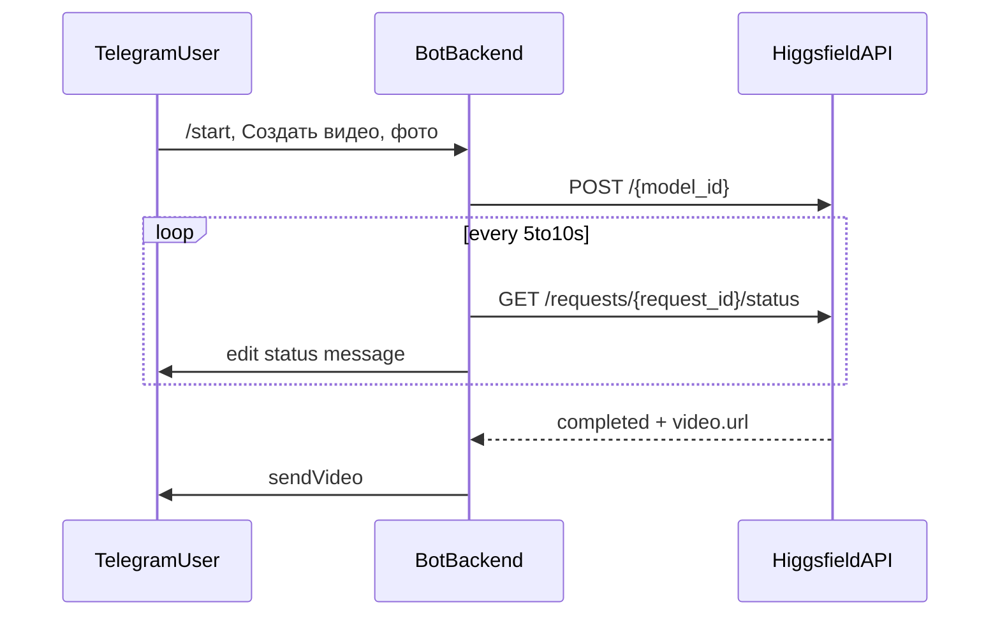

# Техническое задание: MVP Telegram-бот с Higgsfield API

## 1. Цель проекта

Разработать MVP Telegram-бота, который по фото лица генерирует короткое видео через Higgsfield API строго по фиксированному сценарию `Earth zoom in`.

## 2. Область работ

- один бот, один сценарий, одна основная кнопка;
- без выбора пресетов и без пользовательского ввода промпта;
- интеграция с Higgsfield API;
- подготовка документации по запуску, тестированию и демонстрации.

## 3. Бизнес-ограничения

- Пресет/сценарий: только `Earth zoom in`.
- Длительность видео: максимум `15` секунд.
- Частота обновления статуса: целевой интервал 5-7 секунд, максимум 10 секунд.

## 4. Пользовательский поток

1. Пользователь отправляет `/start`.
2. Бот показывает приветствие и кнопку `Создать видео`.
3. По кнопке бот запрашивает фото человека.
4. После фото бот отправляет одно статус-сообщение и обновляет его до завершения.
5. При успехе бот отправляет итоговое видео.

## 5. Функциональные требования

### FR-01 Приветствие
- На `/start` бот отправляет приветственный текст и кнопку `Создать видео`.

### FR-02 Одна кнопка
- В основном интерфейсе доступна одна рабочая кнопка: `Создать видео`.

### FR-03 Прием фото
- Бот принимает `photo` и `document` с MIME `image/*`.
- При невалидном типе контента бот просит отправить фото.

### FR-04 Генерация по фиксированному сценарию
- На каждый запрос в API передаются:
  - `prompt = Earth zoom in`
  - `aspect_ratio = 16:9`
  - `duration <= 15`

### FR-05 Статус генерации
- Бот редактирует одно статус-сообщение в процессе генерации.
- Показывает: текущий статус задачи + прошедшее время.

### FR-06 Финальный результат
- При статусе `completed` отправляется видео в чат.
- При `failed/nsfw/canceled/timeout` отправляется понятная ошибка.

### FR-07 Сброс состояния
- После завершения сценария состояние FSM очищается.

## 6. Нефункциональные требования

### NFR-01 Производительность интерфейса
- Первичный ответ после фото: не более 2 секунд.
- Обновление прогресса: 5-7 секунд (допустимо до 10 секунд).

### NFR-02 Надежность
- Обработка сетевых ошибок без падения процесса.
- Логирование этапов с request_id.

### NFR-03 Безопасность
- Секреты только в `.env`/секрет-хранилище.
- Без хранения секретов в коде и документах, которые попадают в Git.

## 7. Техническая архитектура



## 8. API-контракт Higgsfield

- Base URL: `https://platform.higgsfield.ai`
- Авторизация: `Authorization: Key <HF_API_KEY>:<HF_API_SECRET>`
- Endpoint submit: `POST /{model_id}`
- Endpoint status: `GET /requests/{request_id}/status`

Ссылки:
- [How to use API](https://docs.higgsfield.ai/how-to/introduction)
- [Generate Videos from Images](https://docs.higgsfield.ai/guides/video)
- [SDK auth](https://docs.higgsfield.ai/how-to/sdk)

## 9. Конфигурация окружения

- `TELEGRAM_BOT_TOKEN`
- `HF_API_KEY`
- `HF_API_SECRET`
- `HF_MODEL_ID` (например `higgsfield-ai/dop/standard`)
- `HF_PROMPT=Earth zoom in`
- `HF_ASPECT_RATIO=16:9`
- `HF_DURATION_SECONDS=15`
- `HF_POLL_INTERVAL_SECONDS=6`
- `HF_MAX_WAIT_SECONDS=300`

## 10. Обработка ошибок

- неверный формат медиа;
- пустой `file_path` у Telegram;
- HTTP ошибки Higgsfield (4xx/5xx);
- timeout ожидания;
- `completed`, но без `video.url`.

Для всех ошибок пользователю отдается безопасный текст без внутренних деталей.

## 11. Тестирование

Полная матрица тестов находится в `docs/QA_TEST_PLAN.md`.
Минимум для приемки:

- успешный сценарий end-to-end;
- отклонение невалидного контента;
- обработка API timeout;
- проверка фиксированного промпта `Earth zoom in`;
- проверка ограничения `duration <= 15`.

## 12. Документация и демонстрация

- Инструкция запуска: `README.md`
- QA/UAT: `docs/QA_TEST_PLAN.md`
- Сценарий видео-записи демо: `docs/VIDEO_RECORDING_GUIDE.md`

## 13. Приложение А (конфиденциально): учетные данные

Этот раздел оформляется отдельным файлом вне Git.

Шаблон:

```text
Service: Higgsfield Cloud
Login (email): ______________________
Password: ___________________________
Date issued: ________________________
Access owner: _______________________
```

Правила:
- заполненная версия не коммитится;
- передача только по защищенному каналу;
- после утечки пароль ротируется.
